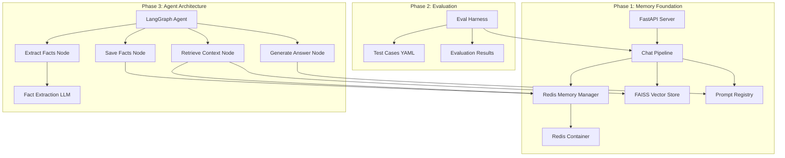
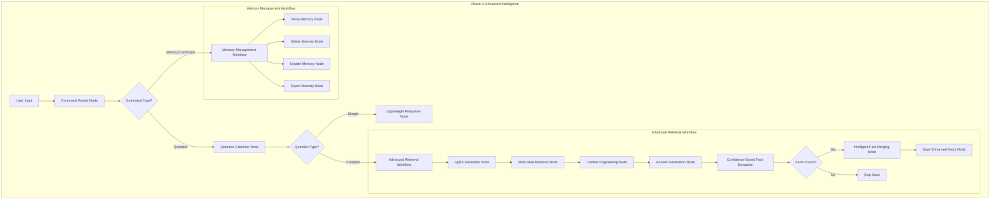

# Design Document

## Overview

The AI Co-founder Evolution transforms the existing mini_chat application through three sequential phases, introducing persistent memory, automated evaluation, and agentic capabilities. The design maintains backward compatibility while adding sophisticated context engineering and learning capabilities.

## Architecture

### High-Level System Architecture



### Component Evolution

The system evolves through three distinct phases:

1. **Phase 1**: Adds Redis-backed memory to existing chat pipeline
2. **Phase 2**: Introduces automated testing framework
3. **Phase 3**: Replaces simple pipeline with LangGraph agent workflow

## Components and Interfaces

### Phase 1 Components

#### RedisMemoryManager
```python
class RedisMemoryManager:
    def get_user_memory(self, user_id: str) -> dict
    def save_user_memory(self, user_id: str, facts: dict)
    def update_user_memory(self, user_id: str, new_facts: dict)
```

**Responsibilities:**
- Manage Redis connections and operations
- Handle JSON serialization/deserialization
- Provide user memory CRUD operations
- Namespace user data properly

#### Enhanced ChatPipeline
```python
class ChatPipeline:
    def ask(self, question: str, user_id: str) -> dict
    def _retrieve_user_context(self, user_id: str) -> dict
    def _retrieve_documents(self, question: str) -> List[Document]
    def _engineer_context(self, user_facts: dict, docs: List[Document]) -> str
```

**Responsibilities:**
- Orchestrate memory retrieval and document search
- Perform context engineering by combining user facts with documents
- Generate responses using enhanced prompts
- Return structured responses with metadata

#### Enhanced API Layer
```python
@app.post("/chat")
def chat(body: dict, user_id: str = Query(...))

@app.get("/memory/{user_id}")
def get_user_memory(user_id: str)

@app.post("/memory/{user_id}")
def update_user_memory(user_id: str, facts: dict)
```

**Responsibilities:**
- Handle user identification via query parameters
- Provide memory management endpoints
- Maintain backward compatibility for existing chat interface

### Phase 2 Components

#### EvaluationHarness
```python
class EvaluationHarness:
    def load_test_cases(self, file_path: str) -> List[TestCase]
    def run_evaluation(self) -> EvaluationResult
    def score_response(self, expected: List[str], actual: str) -> bool
```

**Responsibilities:**
- Load and validate test case configurations
- Execute test cases with proper memory setup
- Score responses against expected criteria
- Generate detailed evaluation reports

#### TestCase Schema
```yaml
id: string
question: string
user_facts: dict
expected_keywords: List[string]
description: string (optional)
```

**Responsibilities:**
- Define structured test case format
- Support user memory injection for testing
- Enable keyword-based response validation

### Phase 3 Components

#### LangGraph Agent State
```python
class AgentState(TypedDict):
    user_id: str
    question: str
    user_facts: dict
    retrieved_docs: List[str]
    answer: str
    newly_extracted_facts: dict
    conversation_history: List[dict]
```

**Responsibilities:**
- Maintain state throughout agent workflow
- Pass data between workflow nodes
- Track conversation context and extracted facts

#### Agent Workflow Nodes

##### RetrieveContextNode
```python
def retrieve_context(state: AgentState) -> AgentState:
    # Retrieve user memory from Redis
    # Retrieve relevant documents from FAISS
    # Update state with context information
```

##### GenerateAnswerNode
```python
def generate_answer(state: AgentState) -> AgentState:
    # Engineer context from user facts and documents
    # Generate response using LLM
    # Update state with generated answer
```

##### ExtractFactsNode
```python
def extract_facts(state: AgentState) -> AgentState:
    # Analyze conversation for new facts
    # Use specialized fact extraction prompt
    # Update state with extracted facts
```

##### SaveFactsNode
```python
def save_facts(state: AgentState) -> AgentState:
    # Merge new facts with existing memory
    # Save updated memory to Redis
    # Log memory updates
```

## Data Models

### User Memory Schema
```json
{
  "user_id": "string",
  "facts": {
    "business_type": "string",
    "state": "string",
    "industry": "string",
    "stage": "string",
    "preferences": {
      "communication_style": "string",
      "detail_level": "string"
    }
  },
  "conversation_count": "integer",
  "last_updated": "timestamp",
  "created_at": "timestamp"
}
```

### Conversation Context Schema
```json
{
  "conversation_id": "string",
  "user_id": "string",
  "messages": [
    {
      "role": "user|assistant",
      "content": "string",
      "timestamp": "timestamp",
      "facts_extracted": "dict"
    }
  ],
  "session_facts": "dict"
}
```

### Test Case Schema
```json
{
  "id": "string",
  "description": "string (optional)",
  "question": "string",
  "user_facts": "dict",
  "expected_keywords": ["string"]
}
```

## Error Handling

### Redis Connection Failures
- Implement connection retry logic with exponential backoff
- Provide graceful degradation when Redis is unavailable
- Log connection issues for debugging
- Return meaningful error messages to users

### Memory Operation Failures
- Handle JSON serialization/deserialization errors
- Validate user memory schema before saving
- Provide rollback mechanisms for failed updates
- Log memory operation failures

### LLM API Failures
- Implement retry logic for transient failures
- Handle rate limiting and quota exceeded errors
- Provide fallback responses when LLM is unavailable
- Log API failures for monitoring

### Agent Workflow Failures
- Handle node execution failures gracefully
- Provide partial results when possible
- Log workflow state for debugging
- Implement workflow recovery mechanisms

## Testing Strategy

### Unit Testing
- Test individual components in isolation
- Mock external dependencies (Redis, OpenAI API)
- Validate data transformations and business logic
- Test error handling and edge cases

### Integration Testing
- Test component interactions
- Validate Redis operations with real Redis instance
- Test LangGraph workflow execution
- Verify API endpoint functionality

### Evaluation Testing
- Automated regression testing using evaluation harness
- Performance benchmarking for response quality
- Memory persistence validation
- Fact extraction accuracy testing

### End-to-End Testing
- Full user journey testing
- Multi-session conversation testing
- Memory evolution validation
- Agent workflow completion testing

## Performance Considerations

### Memory Management
- Implement memory size limits per user
- Use Redis expiration for inactive users
- Optimize JSON serialization for large fact sets
- Monitor Redis memory usage

### Vector Search Optimization
- Maintain FAISS index performance
- Implement result caching for common queries
- Optimize embedding generation
- Monitor search latency

### LLM API Optimization
- Implement response caching for repeated queries
- Optimize prompt length to reduce costs
- Use streaming responses for better UX
- Monitor API usage and costs

### Concurrent User Handling
- Implement proper Redis connection pooling
- Handle concurrent memory updates safely
- Optimize agent workflow for parallel execution
- Monitor system resource usage

## Security Considerations

### User Data Protection
- Implement user data encryption at rest
- Secure Redis connections with authentication
- Validate user input to prevent injection attacks
- Implement data retention policies

### API Security
- Implement rate limiting on API endpoints
- Validate user_id parameters to prevent unauthorized access
- Secure memory management endpoints
- Log security-relevant events

### Memory Isolation
- Ensure user memories are properly isolated
- Prevent cross-user data leakage
- Implement access controls for memory operations
- Audit memory access patterns

## Deployment Architecture

### Local Development
- Docker Compose for Redis and application services
- Environment variable management
- Local file-based configuration
- Development-specific logging

### Container Architecture
```yaml
services:
  redis:
    image: redis/redis-stack-server:latest
    ports: ["6379:6379"]
    volumes: [redis_data:/data]
  
  app:
    build: .
    ports: ["8000:8000"]
    depends_on: [redis]
    environment:
      - REDIS_URL=redis://redis:6379
```

### Configuration Management
- Environment-specific configuration files
- Secure secret management
- Feature flag support for phased rollout
- Runtime configuration updates

## Phase 4: Advanced Intelligence Architecture

### Enhanced Workflow Architecture



### Phase 4 Components

#### Enhanced Agent State
```python
class EnhancedAgentState(TypedDict):
    # Core state (existing)
    user_id: str
    question: str
    user_facts: dict
    retrieved_docs: List[str]
    answer: str
    newly_extracted_facts: dict
    conversation_history: List[dict]
    
    # Phase 4 additions
    command_type: str  # "question", "memory_command", "system"
    question_type: str  # "simple", "complex", "greeting"
    confidence_scores: dict  # fact_id -> confidence_score
    hypothetical_answer: str  # for HyDE retrieval
    retrieval_iterations: int  # for multi-step retrieval
    workflow_path: str  # for analytics
    execution_metrics: dict  # timing and performance data
    user_preferences: dict  # adaptive workflow settings
```

#### Intelligent Workflow Router
```python
class WorkflowRouter:
    def classify_command(self, user_input: str) -> str:
        """Classify input as question, memory command, or system command"""
        
    def classify_question_complexity(self, question: str, user_facts: dict) -> str:
        """Determine if question needs full retrieval or lightweight response"""
        
    def should_extract_facts(self, conversation: str, existing_facts: dict) -> bool:
        """Decide if fact extraction is worth the computational cost"""
```

#### Advanced Fact Management System
```python
class AdvancedFactManager:
    def extract_facts_with_confidence(self, conversation: str) -> dict:
        """Extract facts with confidence scores (0.0-1.0)"""
        
    def merge_facts_intelligently(self, existing: dict, new: dict) -> dict:
        """Use LLM to consolidate and resolve fact conflicts"""
        
    def filter_by_confidence(self, facts: dict, threshold: float = 0.8) -> dict:
        """Only keep facts above confidence threshold"""
        
    def summarize_memory(self, facts: dict, max_size: int) -> dict:
        """Compress memory when it becomes too large"""
```

#### HyDE Retrieval System
```python
class HyDERetriever:
    def generate_hypothetical_answer(self, question: str, user_context: dict) -> str:
        """Generate ideal answer for better embedding search"""
        
    def retrieve_with_hyde(self, question: str, user_context: dict) -> List[Document]:
        """Use hypothetical answer embeddings for retrieval"""
        
    def multi_step_retrieval(self, question: str, initial_docs: List[Document]) -> List[Document]:
        """Iteratively refine retrieval based on initial results"""
        
    def cache_retrieval_results(self, question_hash: str, results: List[Document]):
        """Cache frequently asked question results"""
```

#### User Memory Management Interface
```python
class MemoryCommandProcessor:
    def process_memory_command(self, command: str, user_id: str) -> str:
        """Handle !memory, !forget, !update commands"""
        
    def show_memory_formatted(self, user_id: str) -> str:
        """Display user facts in human-readable format"""
        
    def delete_specific_facts(self, user_id: str, fact_keys: List[str]) -> str:
        """Remove specific facts from user memory"""
        
    def update_fact_interactively(self, user_id: str, fact_key: str, new_value: str) -> str:
        """Update specific fact with user input"""
        
    def export_user_data(self, user_id: str) -> dict:
        """Export all user data for portability"""
```

#### Workflow Analytics System
```python
class WorkflowAnalytics:
    def track_execution_metrics(self, workflow_path: str, execution_time: float, success: bool):
        """Record workflow performance data"""
        
    def analyze_efficiency_patterns(self, user_id: str) -> dict:
        """Identify optimization opportunities for specific users"""
        
    def run_ab_test(self, test_name: str, variant: str, user_id: str) -> str:
        """Execute A/B tests for workflow variations"""
        
    def optimize_thresholds(self, metric_data: dict) -> dict:
        """Automatically adjust confidence thresholds and routing decisions"""
```

### Enhanced Data Models

#### Fact with Confidence Schema
```json
{
  "fact_id": "string",
  "key": "string",
  "value": "any",
  "confidence": "float (0.0-1.0)",
  "source": "string (extraction|user_input|inference)",
  "created_at": "timestamp",
  "last_updated": "timestamp",
  "update_count": "integer"
}
```

#### Workflow Execution Record
```json
{
  "execution_id": "string",
  "user_id": "string",
  "workflow_path": "string",
  "start_time": "timestamp",
  "end_time": "timestamp",
  "total_duration": "float",
  "node_timings": {
    "node_name": "float"
  },
  "success": "boolean",
  "error_details": "string (optional)",
  "input_classification": {
    "command_type": "string",
    "question_type": "string",
    "confidence": "float"
  }
}
```

#### User Preferences Schema
```json
{
  "user_id": "string",
  "adaptive_settings": {
    "preferred_response_speed": "string (fast|balanced|thorough)",
    "fact_extraction_sensitivity": "float (0.0-1.0)",
    "memory_management_style": "string (automatic|manual|hybrid)"
  },
  "learned_patterns": {
    "typical_question_complexity": "string",
    "common_topics": ["string"],
    "interaction_frequency": "string"
  },
  "optimization_history": [
    {
      "change": "string",
      "timestamp": "timestamp",
      "performance_impact": "float"
    }
  ]
}
```

### Advanced Error Handling

#### Graceful Degradation Strategy
```python
class GracefulDegradation:
    def handle_llm_failure(self, fallback_level: int) -> str:
        """Provide increasingly simple fallbacks when LLM fails"""
        
    def handle_retrieval_failure(self, question: str) -> List[str]:
        """Use cached results or simple keyword matching when retrieval fails"""
        
    def handle_memory_failure(self, user_id: str) -> dict:
        """Use session-only memory when Redis is unavailable"""
```

#### Confidence-Based Decision Making
```python
class ConfidenceManager:
    def should_proceed_with_low_confidence(self, confidence: float, operation: str) -> bool:
        """Decide whether to proceed with uncertain operations"""
        
    def escalate_low_confidence_decisions(self, user_id: str, decision: str, confidence: float):
        """Log or flag decisions made with low confidence for review"""
```

### Performance Optimization Architecture

#### Adaptive Caching System
```python
class AdaptiveCaching:
    def cache_by_user_pattern(self, user_id: str, question: str, response: str):
        """Cache responses based on user's typical question patterns"""
        
    def invalidate_cache_intelligently(self, user_id: str, fact_changes: dict):
        """Remove cached responses that are affected by memory updates"""
        
    def precompute_common_responses(self, user_id: str):
        """Pre-generate responses for frequently asked questions"""
```

#### Resource Management
```python
class ResourceManager:
    def allocate_compute_by_priority(self, request_type: str) -> dict:
        """Allocate more resources to complex questions, less to simple ones"""
        
    def monitor_system_load(self) -> dict:
        """Track system performance and adjust workflow complexity accordingly"""
        
    def implement_circuit_breaker(self, service: str, failure_threshold: int):
        """Prevent cascade failures by temporarily disabling failing services"""
```

This enhanced design provides a comprehensive architecture for Phase 4, transforming the AI Co-founder from an excellent system into a state-of-the-art intelligent agent with adaptive capabilities, user control, and sophisticated optimization features.